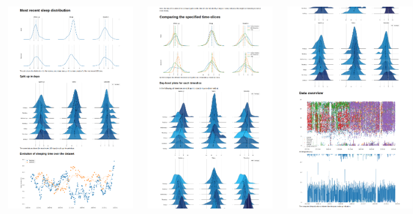

Code for the blogpost at https://vhartmann.com/sleep.

# How to use
- download your data from Google (https://myactivity.google.com/myactivity) and WhatsApp.
  - WhatsApp is instant, depending on what data you choose from Google, the preparation of that zip-file takes a while.
  - Data examples for both can be viewed in the blog post above
- Change the paths in the main.py file, and choose the data sources you want to use
- Change the time-slices you want to look at.
- execute the script via

```
python3 main.py
```

This produces a bunch of .png files, and one ```file.html``` -site, that can then be viewed using the browser of your choice. For me, this is the output:


